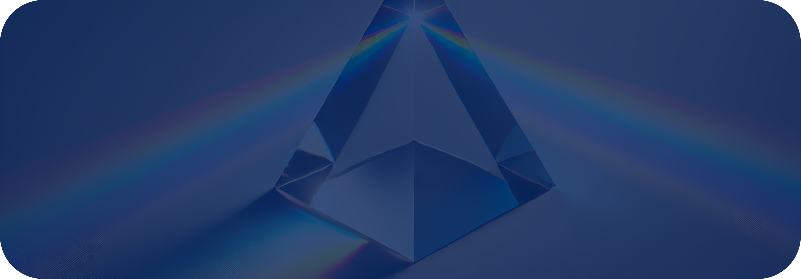

# Mathematical Physics Science
> **Gyroscopic Alignment Research Lab**

<div align="center">
  

<h1>Common Governance Model</h1>
<h3>Deep Physics</h3>
<p><em>Cosmology, Biology, and Beyond...</em></p>

<p>
  <a href="LICENSE">
    
  </a>
  <a href="https://www.python.org">
    
  </a>
</p>

</div>

<div align="center">

### G Y R O G O V E R N A N C E

[](https://gyrogovernance.com)
[](https://github.com/gyrogovernance/diagnostics)
[](https://github.com/gyrogovernance/tools)
[](https://github.com/gyrogovernance/science)
[](https://github.com/gyrogovernance/superintelligence)

</div>

---

## Introduction
    
The Common Governance Model (CGM) presents an axiomatic framework for understanding how structure emerges through recursive alignment. As an axiomatic model, CGM begins from a single foundational principle and derives all subsequent structure through logical necessity. Each theorem follows inevitably from the axiom, with nothing assumed and everything emerging through recursive self-reference.
    
The model demonstrates that three-dimensional space with six degrees of freedom is not an assumption but a logical derivation. Time appears as the sequential ordering of recursive operations, encoded by gyration's memory of operation order. The mathematical formalism employs gyrogroup and bi-gyrogroup structures following Abraham Ungar's work, providing precise language for tracking transitions from undifferentiated potential to fully structured reality.

Recent developments have extended CGM to define quantum gravity as the geometric invariant Q_G = 4π, representing the complete solid angle required for coherent observation. This framework derives fundamental physical constants from pure geometric principles, including the fine-structure constant α to experimental precision (0.043 ppb) and predicts characteristic energy scales through recursive polygon methods. The unified picture reveals physics as the necessary geometry for self-coherent observation.

---

## 📚 Documentation

- 📖 **[CHANGELOG.md](CHANGELOG.md)** - Complete version history and development timeline
- 🌐 **[Foundations](docs/Foundations/CommonGovernanceModel.md)** - Theoretical foundations and mathematical framework

### Key Results & Experiments

| Version | Focus Area | Documentation | Implementation |
|---------|------------|---------------|----------------|
| **1.1.2** | ⚡ Energy Scale Unification | [Analysis](docs/Findings/Analysis_Energy_Scales.md) | [Code](/experiments/cgm_energy_analysis.py) |
| **1.1.0** | 📏 4pi Unification through Alignment | [Analysis](/docs/Findings/Analysis_4pi_Alignment.md) | []() |
| **1.1.0** | 🎯 Fine-Structure Constant | [Analysis](docs/Findings/Analysis_Fine_Structure.md) | [Code](experiments/cgm_alpha_analysis.py) |
| **1.0.9** | ⚛️ Proto-Units Framework | [Analysis](docs/Findings/Analysis_CGM_Units.md) | [Code](experiments/cgm_proto_units_analysis.py) |
| **1.0.8** | 🌌 Quantum Gravity | [Analysis](docs/Findings/Analysis_Quantum_Gravity.md) | [Code](experiments/cgm_quantum_gravity_analysis.py) |
| **1.0.7** | 🔄 Monodromy Structure | [Analysis](docs/Findings/Analysis_Monodromy.md) | [Code](experiments/tw_closure_test.py) |
| **1.0.7** | 📡 Kompaneyets Analysis | [Analysis](docs/Findings/Analysis_Kompaneyets.md) | [Code](experiments/cgm_kompaneyets_analysis.py) |
| **1.0.6** | 🌠 CMB Patterns | [Analysis](docs/Findings/Analysis_CMB.md) | [Code](experiments/cgm_cmb_data_analysis_300825.py) |

**For our Latest work, read our [Changelog](/CHANGELOG.md)

---

## 📊 Current Status

### Theoretical Achievements
- ✅ Derived α = 1/137.036 from pure geometry (0.043 ppb accuracy)
- ✅ Defined quantum gravity as Q_G = 4π (complete solid angle)
- ✅ Predicted gravitational coupling ζ = 23.155 from first principles
- ✅ Established optical conjugacy law: E^UV × E^IR = (E_CS × E_EW)/(4π)²
- ✅ Predicted neutrino masses ~0.06 eV via 48² quantization

### Empirical Validations
- ✅ CMB multipole enhancement at ℓ = 37 and harmonics (p = 0.0039)
- ✅ P₂/C₄ harmonic anti-alignment in Planck data (p = 0.005)
- ✅ Cross-observable phase coherence (R = 0.743)
- ✅ Machine-precision internal consistency (<10⁻¹⁶ errors)
- ✅ Sterile neutrino non-observability consistent with null experimental results

### Active Development
- 🔬 Standard Model particle spectrum derivation
- 🔬 Cosmological dynamics from geometric evolution
- 🔬 Experimental validation programs

---

## 👨‍🔬 Author

**Basil Korompilias**  
*Independent Researcher*  
*Common Governance Model Framework*

Developing mathematical tools for understanding the deep structure of physical reality through recursive geometry.

---

## 📚 Citation

If you use this framework in your research, please cite:

```bibtex
@software{gyrogovernancesciencerepo,
  title={Common Governance Model},
  author={Korompilias, Basil},
  year={2025},
  url={https://github.com/gyrogovernance/science},
  note={Mathematical Physics Framework about Gyroscopic Alignment}
}
```
---

<div style="border: 1px solid #ccc; padding: 1em; font-size: 0.6em; background-color: #f9f9f9; border-radius: 6px; line-height: 1.5;">
  <p><strong>🤖 AI Disclosure</strong></p>
  <p>All software architecture, design, implementation, documentation, and evaluation frameworks in this project were authored and engineered by its Author.</p>
  <p>Artificial intelligence was employed solely as a technical assistant, limited to code drafting, formatting, verification, and editorial services, always under direct human supervision.</p>
  <p>All foundational ideas, design decisions, and conceptual frameworks originate from the Author.</p>
  <p>Responsibility for the validity, coherence, and ethical direction of this project remains fully human.</p>
  <p><strong>Acknowledgements:</strong><br>
  This project benefited from AI language model services accessed through LMArena, Cursor IDE, OpenAI (ChatGPT), Anthropic (Claude), XAI (Grok), Deepseek, and Google (Gemini).</p>
</div>
