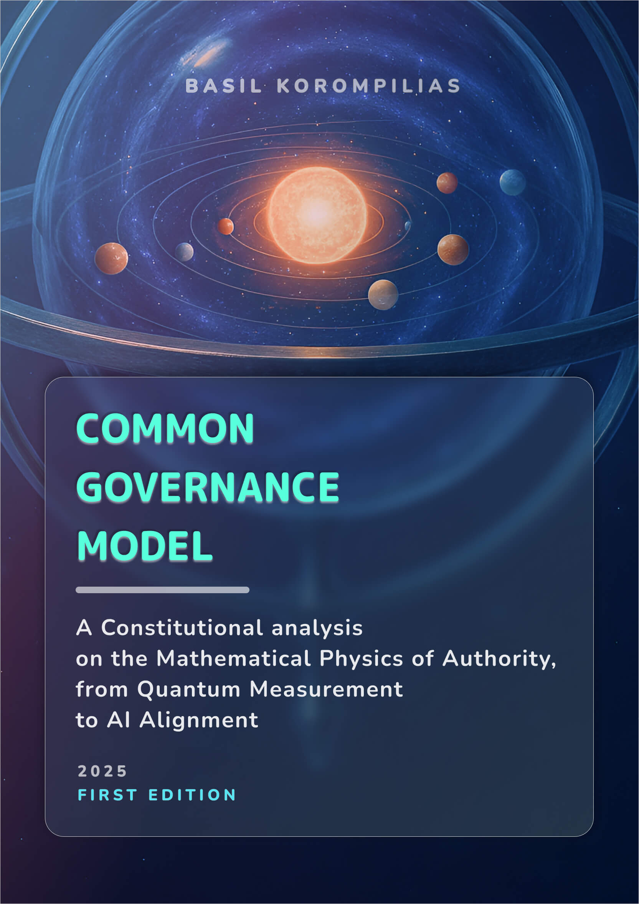

# Mathematical Physics Science
> **Gyroscopic Alignment Research Lab**


### G Y R O G O V E R N A N C E

[](https://gyrogovernance.com)
[](https://github.com/gyrogovernance/apps)
[](https://github.com/gyrogovernance/diagnostics)
[](https://github.com/gyrogovernance/tools)
[](https://github.com/gyrogovernance/science)
[](https://github.com/gyrogovernance/superintelligence)

---

<div>

<h1>🌐 Common Governance Model</h1>
<h3>Fundamental Physics Axiomatization</h3>
<p><em>Information Science, Cosmology, and Beyond...</em></p>

<p>
  <a href="https://doi.org/10.5281/zenodo.17521384">
    
  </a>
  <a href="LICENSE">
    
  </a>
  <a href="https://www.python.org">
    
  </a>
</p>

</div align="center">

The Common Governance Model (CGM) is an axiomatic framework for fundamental physics and information science. It rests on a single axiom: every distinguishable state in a coherent system must trace to a common source. From this requirement, formal modal logic and gyrogroup geometry derive spatial dimensionality, chirality, and conservation laws. Three-dimensional space with six degrees of freedom emerges as a theorem; time is the ordering imposed by recursive operational closure. The theory is implemented and verified on the **Gyroscopic ASI Holonomic Quantum Virtual Machine (hQVM)**.

### Gyroscopic ASI Holonomic Quantum Virtual Machine (hQVM)

The hQVM is the executable form of the framework: a **Holonomic Quantum Virtual Machine** instantiated as a reversible GF(2) finite-state machine on standard silicon. It is a replayable algebraic machine that runs the CGM axioms as integer arithmetic, producing the same trajectories on every run and on any computer. Computation proceeds via geometric phases (monodromies) of closed SE(3) spinorial loops. These are the same holonomic structures that the quantum computing literature recognizes as a universal computational model (Zanardi and Rasetti 1999; Pachos et al. 2000). The same machine is used both as a research tool and as an alignment kernel for AI systems. In this repository it serves as the reference implementation against which the physical predictions are checked: gravity, electroweak masses, wavefunction structure, and related analyses are computed directly on it (22 `hqvm_*.py` scripts in `experiments/`).

Canonical repository: [superintelligence](https://github.com/gyrogovernance/superintelligence). Vendored implementation: [`gyroscopic/hQVM/`](gyroscopic/hQVM/). Specifications and test reports are listed in the documentation section below.

## Headline results

* **Newton's constant G** computed from kernel geometry using the electroweak Higgs scale as the sole measured input. The result matches the CODATA reference value to 0.074 parts per million.
* **Fine-structure constant α** computed from the same geometry, matching the experimental value to 0.043 parts per billion.
* **Three-dimensional space with six degrees of freedom** derived as a theorem of the framework. Explicit proofs exclude two-dimensional and higher-dimensional alternatives.
* **Electroweak particle masses** (Higgs, Z, W, top) and the **weak mixing angle** derived from the same geometric structure that fixes G.
* **W/Z boson mass ratio test:** The framework gives a closed-form relation for m_W/m_Z in terms of the independently derived parameter Δ ≈ 0.0207. Using PDG (Particle Data Group) masses, the implied Δ differs from the monodromy-derived Δ by 8.34 × 10⁻¹⁰ (absolute).
* **Quark generation pattern (scheme dependent):** Under the mass conventions used in the compact-geometry analysis, the six quark masses fall on an integer-spaced ladder in the framework's logarithmic mass coordinate, grouping naturally into three generation pairs.
* **Gravity as a nonlinear theory of geometry** with a position-dependent coupling. The static point-mass exterior closes analytically, recovering Newtonian and general-relativistic limits and yielding an exact, finite gravitational self-energy of −Mc²/4.
* **A complete solid angle of 4π** steradians as the geometric invariant of gravity, fixing the structure of Newton's and Einstein's field equations and the spin-2 character of gravitational waves.
* **The relation E = mc²** derived as a consequence of the Virial condition (2T + V = 0), which follows from the requirement that coherent operational closure forces net displacement to zero every cycle, making the rest frame a dynamical necessity rather than a coordinate choice.
* **Quantum-information certificates from the kernel:** The canonical Hilbert-space lift yields CHSH values saturating Tsirelson's bound and verifies stabilizer-quantum-information properties (teleportation, contextuality), derived from the intrinsic self-dual code structure.

Neutrino mass scales, lepton ratios, and the optical conjugacy linking the Planck and electroweak scales are also derived in the linked analyses.

## Scale of verification

| Measure | Count |
|---------|------:|
| Analysis write-ups (`docs/Findings/Analysis_*.md`) | 30 |
| Runnable experiment scripts (`experiments/*.py`) | 68 |
| hQVM physics scripts (`experiments/hqvm_*.py`) | 22 |
| Shared library and kernel modules (`experiments/`) | 7 |
| hQVM verified features (Tiers A-C) | 243 |
| Python in `experiments/` (all files) | 48,700 lines |

Each major result in the table below maps to one analysis note and its verification code. The scripts cover gravity, electroweak mass geometry, fine structure, quantum gravity, CMB checks, axiomatization, Hilbert-space representation, monodromy, and energy scales.

---
<div align="center">
<a href="docs/CGM.pdf">

</a>
<br><br>
<a href="docs/CGM.pdf">

</a>
</div>

## Documentation and verification

Core writing: [CGM Core](docs/CGM_Paper.md), [CGM Program](docs/CGM_Program.md), [CHANGELOG](CHANGELOG.md).
Dataset: [CGM corpus](docs/datasets/) (1,000+ JSONL Q&A pairs for fine-tuning and RAG).

| Topic | Analysis | Code |
|-------|----------|------|
| Gravity, Virial condition, and nonlinear continuum | [Analysis_Gravity - Note](docs/Findings/Analysis_Gravity_Note.md) [Analysis_Gravity - Full](docs/Findings/Analysis_Gravity.md) | [hqvm_gravity_common.py](experiments/hqvm_gravity_common.py), `hqvm_gravity_analysis_1.py` through `10.py`, [wavefunction scripts](experiments/hqvm_wavefunction_1.py). Run: `python experiments/hqvm_gravity_runner.py` |
| Wavefunction: fiber bundle structure of the byte | [Analysis_hQVM_Wavefunction](docs/Findings/Analysis_hQVM_Wavefunction.md) | [hqvm_wavefunction_kernel.py](experiments/hqvm_wavefunction_kernel.py) |
| Electroweak mass spectrum | [Analysis_Compact_Geometry](docs/Findings/Analysis_Compact_Geometry.md) | [hqvm_compact_geom_core.py](experiments/hqvm_compact_geom_core.py), [kernel](experiments/hqvm_compact_geom_kernel.py), [report](experiments/hqvm_compact_geom_report.py), [derivations](experiments/hqvm_compact_geom_derivations.py) |
| Fine-structure constant | [Analysis_Fine_Structure](docs/Findings/Analysis_Fine_Structure.md) | [cgm_alpha_analysis.py](experiments/cgm_alpha_analysis.py) |
| Quantum gravity invariant | [Analysis_Quantum_Gravity](docs/Findings/Analysis_Quantum_Gravity.md) | [cgm_quantum_gravity_analysis.py](experiments/cgm_quantum_gravity_analysis.py) |
| Energy scale unification | [Analysis_Energy_Scales](docs/Findings/Analysis_Energy_Scales.md) | [cgm_energy_analysis.py](experiments/cgm_energy_analysis.py) |
| 4π unification | [Analysis_4pi_Alignment](docs/Findings/Analysis_4pi_Alignment.md) | |
| 3D space and six degrees of freedom | [Analysis_3D_6DOF_Proof](docs/Findings/Analysis_3D_6DOF_Proof.md) | [cgm_3D_6DoF_analysis.py](experiments/cgm_3D_6DoF_analysis.py) |
| Axiomatization | [Analysis_Axiomatization](docs/Findings/Analysis_Axiomatization.md) | [cgm_axiomatization_analysis.py](experiments/cgm_axiomatization_analysis.py) |
| Hilbert space representation | [Analysis_Hilbert_Space_Representation](docs/Findings/Analysis_Hilbert_Space_Representation.md) | [cgm_Hilbert_Space_analysis.py](experiments/cgm_Hilbert_Space_analysis.py) |
| CMB patterns (Planck: enhanced power at ℓ=37, p=0.0039) | [Analysis_CMB](docs/Findings/Analysis_CMB.md) | [cgm_cmb_data_analysis_300825.py](experiments/cgm_cmb_data_analysis_300825.py) |
| Spin-2 from orientation recovery | [Analysis_Monodromy](docs/Findings/Analysis_Monodromy.md) | [tw_closure_test.py](experiments/tw_closure_test.py) |
| Kompaneyets | [Analysis_Kompaneyets](docs/Findings/Analysis_Kompaneyets.md) | [cgm_kompaneyets_analysis.py](experiments/cgm_kompaneyets_analysis.py) |
| Proto-units | [Analysis_CGM_Units](docs/Findings/Analysis_CGM_Units.md) | [cgm_proto_units_analysis.py](experiments/cgm_proto_units_analysis.py) |
| Gyroscopic multiplication | [Analysis_Gyroscopic_Multiplication](docs/Findings/Analysis_Gyroscopic_Multiplication.md) | |

### hQVM specifications and test reports

| Document | Description |
|----------|-------------|
| [Gyroscopic_ASI_Specs](docs/Gyroscopic_Computational_Theory/Gyroscopic_ASI_Specs.md) | Normative specification |
| [Gyroscopic_ASI_Specs_Formalism](docs/Gyroscopic_Computational_Theory/Gyroscopic_ASI_Specs_Formalism.md) | Formalism |
| [Gyroscopic_ASI_Holography](docs/Gyroscopic_Computational_Theory/Gyroscopic_ASI_Holography.md) | Holography |
| [Gyroscopic_ASI_SDK_Quantum_Computing](docs/Gyroscopic_Computational_Theory/Gyroscopic_ASI_SDK_Quantum_Computing.md) | SDK |
| [hQVM_Tests_Report_1](docs/Gyroscopic_Computational_Theory/hQVM_Tests_Report_1.md) | Test report 1 |
| [hQVM_Tests_Report_2](docs/Gyroscopic_Computational_Theory/hQVM_Tests_Report_2.md) | Test report 2 |
| [Physics_Tests_Report](docs/Gyroscopic_Computational_Theory/Physics_Tests_Report.md) | Physics tests |
| [QuBEC_Theory](docs/Gyroscopic_Computational_Theory/QuBEC_Theory.md) | QuBEC theory |
| [Alignment_Measurement_Report](docs/Gyroscopic_Computational_Theory/Alignment_Measurement_Report.md) | Alignment measurement |
| [hQVM_Features_Report](docs/Gyroscopic_Computational_Theory/hQVM_Features_Report.md) | 243 verified features (Tiers A-C) |

---
## 👨‍🔬 Author

**Basil Korompilias**
*Independent Researcher*
*Common Governance Model Framework*

---
## 📚 Citation

```bibtex
@software{gyrogovernancesciencerepo,
title={Common Governance Model: Mathematical Physics Framework},
author={Korompilias, Basil},
year={2025},
doi={10.5281/zenodo.17521384},
url={https://github.com/gyrogovernance/science},
orcid={0009-0006-4967-1245}
}
```

**Paper (v1.2.4):** [10.5281/zenodo.17794470](https://doi.org/10.5281/zenodo.17794470)
**All versions:** [10.5281/zenodo.17521384](https://doi.org/10.5281/zenodo.17521384)

---
<div style="border: 1px solid #ccc; padding: 1em; font-size: 0.6em; background-color: #f9f9f9; border-radius: 6px; line-height: 1.5;">
<p><strong>🤖 AI Disclosure</strong></p>
<p>All software architecture, design, implementation, documentation, and evaluation frameworks in this project were authored and engineered by its Author.</p>
<p>Artificial intelligence was employed solely as a technical assistant, limited to code drafting, formatting, verification, and editorial services, always under direct human supervision.</p>
<p>All foundational ideas, design decisions, and conceptual frameworks originate from the Author.</p>
<p>Responsibility for the validity, coherence, and ethical direction of this project remains fully human.</p>
<p><strong>Acknowledgements:</strong><br>
This project benefited from AI language model services accessed through Z.AI, Arena, Cursor IDE, OpenAI (ChatGPT), Anthropic (Claude), XAI (Grok), Deepseek, and Google (Gemini).</p>
</div>