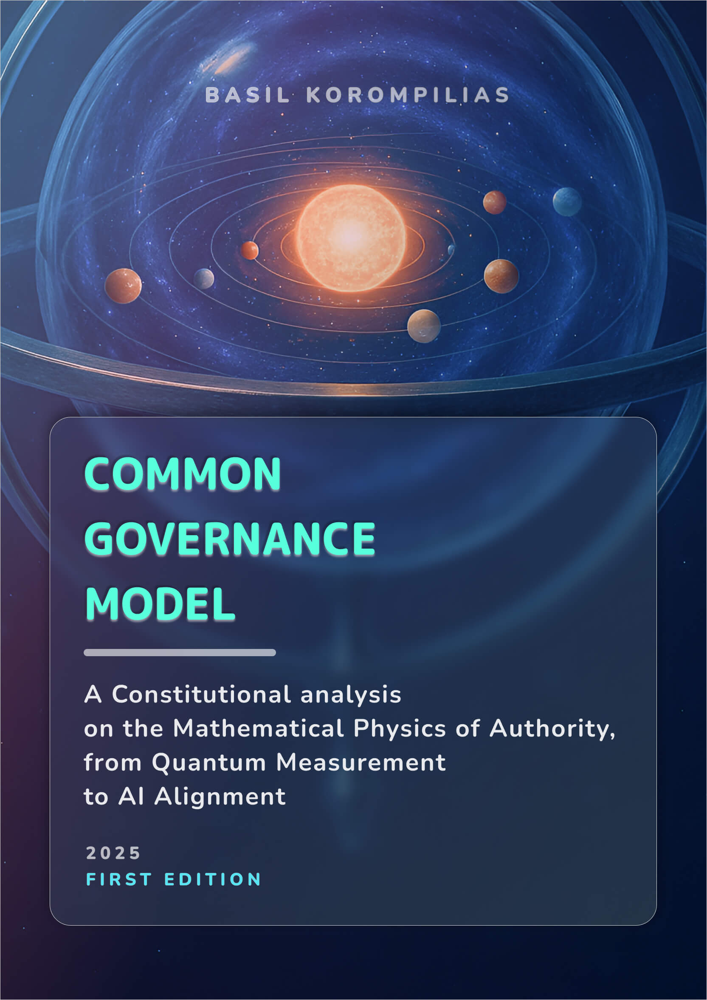

# Mathematical Physics Science
> **Gyroscopic Alignment Research Lab**


### G Y R O G O V E R N A N C E

[](https://gyrogovernance.com)
[](https://github.com/gyrogovernance/apps)
[](https://github.com/gyrogovernance/diagnostics)
[](https://github.com/gyrogovernance/tools)
[](https://github.com/gyrogovernance/science)
[](https://github.com/gyrogovernance/superintelligence)

---

<div align="center">

<h1>🌐 Common Governance Model</h1>
<h3>Fundamental Physics Axiomatization</h3>
<p><em>Information Science, Cosmology, and Beyond...</em></p>

<p>
  <a href="https://doi.org/10.5281/zenodo.17521384">
    
  </a>
  <a href="LICENSE">
    
  </a>
  <a href="https://www.python.org">
    
  </a>
</p>

</div align="center">

The Common Governance Model (CGM) is an axiomatic framework for fundamental physics and information science. It rests on a single axiom: every distinguishable state in a coherent system must trace to a common source. From this requirement, formal modal logic and gyrogroup geometry derive spatial dimensionality, chirality, and conservation laws. Three-dimensional space with six degrees of freedom emerges as a theorem, while time is the ordering imposed by recursive operational closure. The theory is implemented and verified on a **Holonomic Quantum Virtual Machine (hQVM)**.

### Holonomic Quantum Virtual Machine (hQVM)

The hQVM is the executable form of the framework: a **Holonomic Quantum Virtual Machine** instantiated as a reversible GF(2) finite-state transducer. It is a replayable algebraic machine that runs the CGM axioms as integer arithmetic. Computation proceeds via geometric phases (holonomies) of closed SE(3) spinorial loops. These are the same holonomic structures that the quantum computing literature recognizes as a universal computational model (Zanardi and Rasetti 1999; Pachos et al. 2000). The same machine is used both as a research tool and as an alignment kernel for AI systems. In this repository it serves as the reference implementation against which the physical predictions are checked: gravity, electroweak masses, nuclear structure, the Yang–Mills mass-gap readout, organismal allometry, wavefunction structure, generator-restricted percolation, and related analyses are computed directly on it (65 `hqvm_*.py` scripts in `experiments/`, plus `experiments/hQVM_CGM_YM_Gap/`).

Canonical repository: [superintelligence](https://github.com/gyrogovernance/superintelligence). Vendored implementation: [`gyroscopic/hQVM/`](gyroscopic/hQVM/).

## Headline results

All results below derive from the hQVM kernel geometry and its shared logarithmic mass ruler. Because the framework uses no free parameters, a single geometric structure fixes the dimensionality of space, physical constants, and scaling laws across disciplines.

### Foundations

* **Three-dimensional space with six degrees of freedom** emerges as a proven theorem.
* **The full 4π solid angle of a sphere** serves as the geometric invariant of gravity, fixing the structure of classical field equations and the spin-2 character of gravitational waves.
* **Mass-energy equivalence (E = mc²)** follows dynamically because operational closure forces net displacement to zero each cycle, making the rest frame a physical necessity rather than a coordinate choice.

### Physical constants

* **Newton's gravitational constant G** is computed using only the electroweak Higgs scale as an external input, matching the CODATA reference value to within 3 parts per million.
* **The fine-structure constant α** matches the CODATA 2018 value to within 34 parts per billion after geometric transport corrections.
* **The electroweak particle masses** (Higgs, Z, W, top) and the weak mixing angle are fixed entirely by the kernel.
* **The W and Z boson masses** successfully reconstruct the internal mass-ruler spacing to an absolute error of 7.899 × 10⁻¹⁰.

### Nuclear and particle structure

* **Nuclear physics** shares the electroweak mass ruler to predict the deuteron binding energy, the thorium-229 isomer transition, beta-decay routing, and the standard magic-number sequence (2, 8, 20, 28, 50, 82, 126) with zero free parameters.
* **The six quark masses** fall on a regular ladder in the logarithmic coordinate and group naturally into three generation pairs.

### Gravity and gauge theory

* **Gravity** operates as a nonlinear geometric theory where the static point-mass exterior closes analytically, yielding a finite self-energy of −Mc²/4.
* **The Yang–Mills mass gap** is calculated at approximately 1.58 GeV, placing it within the expected range for light scalar glueballs.

### Biology and scaling

* **Organismal metabolism** follows the spatial geometry to yield standard 3/4 and 2/3 scaling bands, a quarter-power lifespan law, and a 3/16 development law, which are successfully audited against mammalian trait catalogs.

### Information-theoretic applications

* **The mathematical carrier** lifts to a quantum representation that saturates the Bell inequality and verifies standard teleportation protocols.
* **The machine supports offline digital receipts** whose validity is verified by local deterministic replay rather than a global ledger.

## Scale of verification

| Measure | Count |
|---------|------:|
| Formal Documentation (Analyses, Specs, Reports) | 50+ |
| Scripts (Experiments, Tests, Derivations) | 112 |
| hQVM specific | 72 |
| hQVM verified Features (mathematical physics formal proofs) | 283 |
| Lines of Python | ~91,000 lines |
| Team Size	 | 1 |
| Institutional Support - Funding | 0 |

---
<div align="center">
<a href="docs/CGM.pdf">

</a>
<br><br>
<a href="docs/CGM.pdf">

</a>
</div>

## Documentation and verification

### Start here

| Document | Description |
|----------|-------------|
| [CGM Logic](docs/CGM_Logic.md) | Construction logic of the framework and shared foundations across the formal layers |
| [CGM Paper](docs/CGM_Paper.md) | Axiomatic paper: modal logic, gyrogroup geometry, dimensional emergence, and physical structure |
| [CGM Program](docs/CGM_Program.md) | Research programme guide: foundations, derivation map, and links across the corpus |
| [CHANGELOG](CHANGELOG.md) | Release history and version notes |
| [CGM corpus](docs/datasets/) | Dataset of 1,000+ JSONL Q&A pairs for fine-tuning and RAG |

### Analyses and verification code

**Framework and constants analyses**

| Topic | Analysis | Verification |
|-------|----------|--------------|
| Axiomatization | [Analysis_Axiomatization](docs/Findings/Analysis_Axiomatization.md) | Runner: [cgm_axiomatization_analysis.py](experiments/cgm_axiomatization_analysis.py) |
| 3D space and six degrees of freedom | [Analysis_3D_6DOF_Proof](docs/Findings/Analysis_3D_6DOF_Proof.md) | Runner: [cgm_3D_6DoF_analysis.py](experiments/cgm_3D_6DoF_analysis.py) |
| Holonomy: closed-path memory, dual-pole loop angle δ_BU | [Analysis_Holonomy](docs/Findings/Analysis_Holonomy.md) | Runner: [cgm_holonomy_analysis_run.py](experiments/cgm_holonomy_analysis_run.py) · Results: [cgm_holonomy_analysis_results.txt](experiments/cgm_holonomy_analysis_results.txt) |
| Precession: three connections, closed-walk spectrum | [Analysis_Precession](docs/Findings/Analysis_Precession.md) | Runner: [cgm_precession_analysis_run.py](experiments/cgm_precession_analysis_run.py) · Results: [cgm_precession_analysis_results.txt](experiments/cgm_precession_analysis_results.txt) |
| Quantum gravity invariant Q_G = 4π | [Analysis_Quantum_Gravity](docs/Findings/Analysis_Quantum_Gravity.md) | Runner: [cgm_quantum_gravity_analysis.py](experiments/cgm_quantum_gravity_analysis.py) |
| 4π alignment across gravitational and gauge sectors | [Analysis_4pi_Alignment](docs/Findings/Analysis_4pi_Alignment.md) | — |
| Fine-structure constant | [Analysis_Fine_Structure](docs/Findings/Analysis_Fine_Structure.md) | Runner: [cgm_alpha_analysis.py](experiments/cgm_alpha_analysis.py) |
| Energy scale unification | [Analysis_Energy_Scales](docs/Findings/Analysis_Energy_Scales.md) | Runner: [cgm_energy_analysis.py](experiments/cgm_energy_analysis.py) |
| Hilbert space representation | [Analysis_Hilbert_Space_Representation](docs/Findings/Analysis_Hilbert_Space_Representation.md) | Runner: [cgm_Hilbert_Space_analysis.py](experiments/cgm_Hilbert_Space_analysis.py) |
| Proto-units | [Analysis_CGM_Units](docs/Findings/Analysis_CGM_Units.md) | Runner: [cgm_proto_units_analysis.py](experiments/cgm_proto_units_analysis.py) |
| Gyroscopic multiplication | [Analysis_Gyroscopic_Multiplication](docs/Findings/Analysis_Gyroscopic_Multiplication.md) | — |
| CMB patterns (cosmological readout) | [Analysis_CMB](docs/Findings/Analysis_CMB.md) | Runner: [cgm_cmb_data_analysis_300825.py](experiments/cgm_cmb_data_analysis_300825.py) |
| Kompaneyets | [Analysis_Kompaneyets](docs/Findings/Analysis_Kompaneyets.md) | Runner: [cgm_kompaneyets_analysis.py](experiments/cgm_kompaneyets_analysis.py) |

**hQVM kernel analyses**

| Topic | Analysis | Verification |
|-------|----------|--------------|
| Gravity, Virial condition and nonlinear continuum | [Analysis_Gravity](docs/Findings/Analysis_Gravity.md) | Runner: [hqvm_gravity_runner.py](experiments/hqvm_gravity_runner.py) |
| Wavefunction: fiber bundle structure of the byte | [Analysis_hQVM_Wavefunction](docs/Findings/Analysis_hQVM_Wavefunction.md) | Runner: [hqvm_wavefunction_kernel.py](experiments/hqvm_wavefunction_kernel.py) |
| Electroweak mass spectrum, Δ ruler | [Analysis_Compact_Geometry](docs/Findings/Analysis_Compact_Geometry.md) | Runner: [hqvm_compact_geom_run.py](experiments/hqvm_compact_geom_run.py) · Results: [hqvm_compact_geom_results.txt](experiments/hqvm_compact_geom_results.txt) |
| Nuclear isomer, deuteron, fusion resonances, magic numbers | [Analysis_hQVM_CGM_Trestleboard](docs/Findings/Analysis_hQVM_CGM_Trestleboard.md) | Runner: [hqvm_cgm_trestleboard_run.py](experiments/hqvm_cgm_trestleboard_run.py) · Results: [hqvm_cgm_trestleboard_results.txt](experiments/hqvm_cgm_trestleboard_results.txt) |
| Yang–Mills mass gap from the CGM aperture | [Analysis_hQVM_CGM_YM_Mass_Gap](docs/Findings/Analysis_hQVM_CGM_YM_Mass_Gap.md) | Runner: [Yang_Mills_Mass_Gap_run.py](experiments/hQVM_CGM_YM_Gap/Yang_Mills_Mass_Gap_run.py) · Results: [Yang_Mills_Mass_Gap_results.txt](experiments/hQVM_CGM_YM_Gap/Yang_Mills_Mass_Gap_results.txt) |
| Genomics: genetic code as fold-obstructed quotient, ordered transport on Omega | [Analysis_hQVM_CGM_Genomics](docs/Findings/Analysis_hQVM_CGM_Genomics.md) | Runner: [hqvm_cgm_genomics_run.py](experiments/hqvm_cgm_genomics_run.py) · Results: [hqvm_cgm_genomics_results.txt](experiments/hqvm_cgm_genomics_results.txt) |
| Allometric scaling from the hQVM formalism | [Analysis_hQVM_CGM_Allometry](docs/Findings/Analysis_hQVM_CGM_Allometry.md) | Runner: [hqvm_cgm_allometry_run.py](experiments/hqvm_cgm_allometry_run.py) · Results: [hqvm_cgm_allometry_results.txt](experiments/hqvm_cgm_allometry_results.txt) |
| Generator-restricted percolation; Square-Root Cluster Theorem | [Analysis_hQVM_Percolation](docs/Findings/Analysis_hQVM_Percolation.md) | Runner: [hqvm_percolation_analysis_run.py](experiments/hqvm_percolation_analysis_run.py) · Results: [hqvm_percolation_analysis_results.txt](experiments/hqvm_percolation_analysis_results.txt) · [hqvm_percolation_analysis_5_results.txt](experiments/hqvm_percolation_analysis_5_results.txt) |
| Cohomology layer | [Analysis_hQVM_Cohomology](docs/Findings/Analysis_hQVM_Cohomology.md) | Runner: [hqvm_Cohomology_analysis_run.py](experiments/hqvm_Cohomology_analysis_run.py) · Results: [hqvm_Cohomology_analysis_results.txt](experiments/hqvm_Cohomology_analysis_results.txt) |
| Operator group `G = (GF(2)⁶ × GF(2)⁶) ⋊ C₂` | [Analysis_hQVM_CGM_Group_Theory](docs/Findings/Analysis_hQVM_CGM_Group_Theory.md) | Runner: [hqvm_group_analysis_run.py](experiments/hqvm_group_analysis_run.py) · Results: [hqvm_group_analysis_results.txt](experiments/hqvm_group_analysis_results.txt) |

**Information-theoretic applications**

| Topic | Analysis | Verification |
|-------|----------|--------------|
| Quantum-information certificates (CHSH, stabilizer lift) | [Analysis_hQVM_Wavefunction](docs/Findings/Analysis_hQVM_Wavefunction.md) | Runner: [hqvm_wavefunction_kernel.py](experiments/hqvm_wavefunction_kernel.py) |
| Replayable settlement and offline receipts | [Analysis_hQVM_Moments_Fiat](docs/Findings/Analysis_hQVM_Moments_Fiat.md) | Runner: [hqvm_moments_fiat_analysis_run.py](experiments/hqvm_moments_fiat_analysis_run.py) · Results: [hqvm_moments_fiat_analysis_results.txt](experiments/hqvm_moments_fiat_analysis_results.txt) |

### hQVM specifications and test reports

| Document | Description |
|----------|-------------|
| [hQVM_Specs_Formalism](docs/Gyroscopic_Computational_Theory/hQVM_Specs_Formalism.md) | Formalism |
| [hQVM_SDK_Quantum_Computing](docs/Gyroscopic_Computational_Theory/hQVM_SDK_Quantum_Computing.md) | SDK |
| [hQVM_QuBEC_Theory](docs/Gyroscopic_Computational_Theory/hQVM_QuBEC_Theory.md) | QuBEC theory |
| [hQVM_Features_Report](docs/Gyroscopic_Computational_Theory/hQVM_Features_Report.md) | 283 verified kernel features |
| [hQVM_Tests_Report_1](docs/Gyroscopic_Computational_Theory/hQVM_Tests_Report_1.md) | Test report 1 |
| [hQVM_Tests_Report_2](docs/Gyroscopic_Computational_Theory/hQVM_Tests_Report_2.md) | Test report 2 |
| [Physics_Tests_Report](docs/Gyroscopic_Computational_Theory/Physics_Tests_Report.md) | Physics tests |
| [Measurement_Tests_Report](docs/Gyroscopic_Computational_Theory/Measurement_Tests_Report.md) | Alignment measurement |
| [Moments_Tests_Report](docs/Gyroscopic_Computational_Theory/Moments_Tests_Report.md) | Moments Fiat tests |
| [AIR_Moments_Economy_Whitepaper](docs/Gyroscopic_Computational_Theory/AIR_Moments_Economy_Whitepaper.md) | Moments Fiat coordination economy |

---
## 👨‍🔬 Author

**Basil Korompilias**
*Independent Researcher*
*Common Governance Model Framework*

---
## 📚 Citation

```bibtex
@software{gyrogovernancesciencerepo,
title={Common Governance Model: Mathematical Physics Framework},
author={Korompilias, Basil},
year={2025},
doi={10.5281/zenodo.17521384},
url={https://github.com/gyrogovernance/science},
orcid={0009-0006-4967-1245}
}
```

**Paper (v1.2.4):** [10.5281/zenodo.17794470](https://doi.org/10.5281/zenodo.17794470)
**All versions:** [10.5281/zenodo.17521384](https://doi.org/10.5281/zenodo.17521384)

---
<div style="border: 1px solid #ccc; padding: 1em; font-size: 0.6em; background-color: #f9f9f9; border-radius: 6px; line-height: 1.5;">
<p><strong>🤖 AI Disclosure</strong></p>
<p>All software architecture, design, implementation, documentation, and evaluation frameworks in this project were authored and engineered by its Author.</p>
<p>Artificial intelligence was employed solely as a technical assistant, limited to code drafting, formatting, verification, and editorial services, always under direct human supervision.</p>
<p>All foundational ideas, design decisions, and conceptual frameworks originate from the Author.</p>
<p>Responsibility for the validity, coherence, and ethical direction of this project remains fully human.</p>
<p><strong>Acknowledgements:</strong><br>
This project benefited from AI language model services accessed through Cursor IDE, OpenAI (ChatGPT), Anthropic (Claude), Z.AI, XAI (Grok), Deepseek, Google (Gemini), Arena and Comparity.ai .</p>
</div>